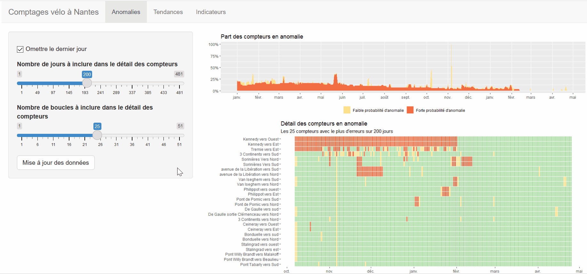

# Comptages_velo_Nantes
A shiny application for to monitor bike counters in Nantes: anomaly detection, trend analysis and indicator calculations.
All the source data is available at : https://data.nantesmetropole.fr   
Read the working paper: https://hal.archives-ouvertes.fr/hal-03105063

# Counter anomaly supervision

# Counting trend analysis

